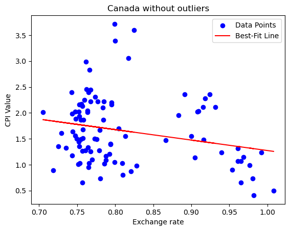
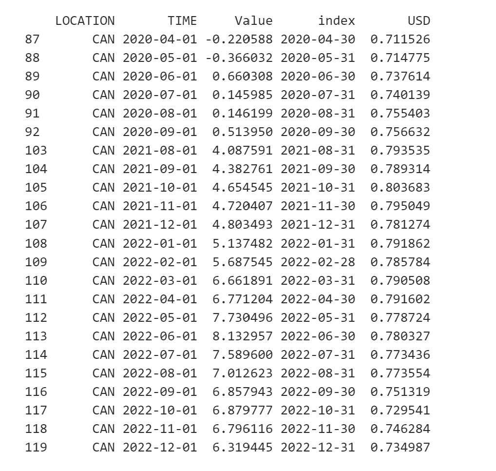

   

        <b>
            
                SOOOO expensive!💰
            
        </b>
    

   

        <b>
            
                Data investigation of the correlation between exchange rate vs inflation rate
            
        </b>
    

   

        
                Ke Chen, Yujia Zhu, Maggie Miao
        
    

>

## ⚙️ Introduction
As international students studying abroad, we have chosen this topic for it is closely related to our living standards. Inflation measures how much more expensive a set of goods and services has become over a certain period (IMF definition), which is critical for us to manage the way we allocate money.

The exchange rate is equally important to us because we need to constantly monitor the fluccuation in exchange rate, as every single transaction we make is linked to the exchange rate at the time. Hence, inflation and exchange rates are linked to our life thus motivate us to investigate their correlation.

Based on economic theory, we understand if the value of the US dollar stays consistent whilst another country’s exchange rate decreases, the currency depreciates in that country and could result in inflationary pressure in its economy. Thus, there is a negative relationship between exchange rate and inflation. Despite comprehending the relationship between inflation and exchange rate on a theoretical level, we would like to investigate and obtain some real-world evidence to support the negative relationship between exchange rates and inflation rates. Therefore, we collect data on exchange rates against the US dollar and inflation index to find the real correlation over the past 10 years. 
  

## 📝 Project description
This project is aimed to examine the strength and relationship between inflation and exchange rate. Specifically, we have chosen the top 10 GDP countries as our analysing target for this investigation, and the data collected will focus on the recent ten years of data from 2013 to 2022.

We use the monthly consumer products index (CPI) as the indicator of inflation and calculate the monthly average exchange rate to match the former.

This study employs the quantitative methodology to examine the correlation between those two factors. We adopt a range of exploratory analyses, which includes visualisation, Ordinary least squares regression (OLS) and Pearson correlation coefficient. We focus on R-square, p-value and Pearson coefficient to evaluate the correlations.

This project primarily aims to contribute to the examination therelationshipn between exhcange rates and inflation. Ultimately, we address some limitations in our study.

### Plan

Our project contains two parts: Data collection and preprocessing and Exploratory Data Analysis.

**Data collection and preprocessing**
1. Collecting data from Exchange rates data-API and OECD datasets

2. Cleaning data and preprocessing datasets
    - Selecting the exchange rate of the local currency against the US dollar and calculating the monthly average exchange rate 
    - Cleaning the original static dataframe of CPI 

3. Overall Visualisation
- Map
- Line Chart

**Exploratory Data Analysis**

In this step, our analysis is will turn to focusing on each individual country since we found that the correlation between exchange rate and inflation is different in different countries.

1. OLS regression + best-fit line
2. Pearson correlation coefficient  

## 📊 Data
### Data Source
- [Exchange rates data-API](https://apilayer.com/marketplace/exchangerates_data-api)
- [OECD data](https://data.oecd.org/price/inflation-cpi.htm)

### Data collection + cleaning + preprocessing

We mainly use ‘pandas' package to obtain the final 10 data frames for exploratory analysis, each including the country's CPI and exchange rate for the period 2013-2022. The exchange rate data is collected by using API we found from "apilayer" and the CPI data is static dataset we found from OECD website. 

The complete cleaning and preprocessing process can be found in link at the end of this part.

### Visualisation

We use the following visualisation to show the overall trend of exchange rate and inflation in each country.

**Map**

From this map, we are able to discover the inflation level around the world geographically. Yellow represents a high level of inflation and purple represents a low level of inflation. We can see that countries in Europe and North America are maintaining moderate levels of inflation, countries in East Asia are experiencing lower levels of inflation and Russia is experiencing higher levels of inflation.
Click on this link to view the [Map](Map.html).

**Line chart**

    
    

We found that the variation of exchange rate and inflation is different in different countries, so we further investigate the correlation between them in each country.  

**Country trend**

We combine the trend of exchange rate and inflation together to visualise the correlation between them.

Here is the example of China and Russia: 

    
    

We will specify the country trend in the following part. 

*Here is the link for code used in data collection and preprocessing*
[Link to view code](Data.md)  

## 📈 Exploratory Data Analysis

In the second part of our study, we take steps closer to every country. We investigate the correlation between exchange rate and inflation in each country by using OLS regression. We will visualize the correlation by using best-fit line and Pearson correlation coefficient. Click on the country name to see details.

  
<strong><u>China</u></strong>

  <strong>OLS regression + best-fit line</strong>
  
  

      

          
      

      

          <table style="margin: auto;">
              <tr>
                  <th>Coefficients</th>
                  <th>R-squared</th>
                  <th>p-value</th>
              </tr>
              <tr>
                  <td>-34.032598</td>
                  <td>0.069058</td>
                  <td>0.003735</td>
              </tr>
          </table>
      

  

   

  <strong>Pearson correlation coefficient</strong>

   
  
  

      

          
      

      

          <table style="margin: auto; width: 100%;">
             <tr>
                 <th style="width: 30%;">Time period</th>
                 <th style="width: 30%;">Pearson correlation coefficient</th>
                 <th style="width: 30%;">p-value</th>
             </tr>
             <tr>
                 <td>2013-2022</td>
                 <td>-0.262789</td>
                 <td>0.003735</td>
             </tr>
             <tr>
                 <td>2013-2017</td>
                 <td>0.340475</td>
                 <td>0.007771</td>
             </tr>
             <tr>
                 <td>2018-2022</td>
                 <td>-0.587713</td>
                 <td>7.9354e-07</td>
             </tr>
         </table>
      

  

 

From the graph of the best-fit line, we could observe a negative correlation between exchange rate and inflation in China. In the time period of 2013-2017, the correlation is positive, which means that the exchange rate and inflation are positively correlated. In the time period of 2018-2022, the correlation is negative, which means that the exchange rate and inflation are negatively correlated. In the ten-year period, the correlation is negative. 

The p-values are less than 0.05. Therefore, we can conclude that the correlation we get between exchange rate and inflation in China is significant. However, time effect is also critical in this case. The correlation between exchange rate and inflation in China varies in different time periods.
  

  
<strong><u>Canada</u></strong>

  <strong>OLS regression + best-fit line</strong>
  
  

      

          
      

      

          <table style="margin: auto;">
              <tr>
                  <th>Coefficients</th>
                  <th>R-squared</th>
                  <th>p-value</th>
              </tr>
              <tr>
                  <td>-4.316177</td>
                  <td>0.031361</td>
                  <td>0.052997</td>
              </tr>
          </table>
      

  

   

  <strong>Pearson correlation coefficient</strong>

   
  
  

      

          
      

      

          <table style="margin: auto; width: 100%;">
             <tr>
                 <th style="width: 30%;">Time period</th>
                 <th style="width: 30%;">Pearson correlation coefficient</th>
                 <th style="width: 30%;">p-value</th>
             </tr>
             <tr>
                 <td>2013-2022</td>
                 <td>-0.177090</td>
                 <td>0.052997</td>
             </tr>
             <tr>
                 <td>2013-2019</td>
                 <td>-0.353245</td>
                 <td>0.000981</td>
             </tr>
             <tr>
                 <td>2020-2021</td>
                 <td>0.750873</td>
                 <td>2.3635e-05</td>
             </tr>
             <tr>
                 <td>2021-2022</td>
                 <td>-0.534864</td>
                 <td>0.007083</td>
             </tr>
         </table>
      

  

   

Unlike the result of China, the p-value of Canada is greater than 0.05. Therefore, we cannot conclude that the correlation between exchange rate and inflation in Canada is significant. However, the R-squared is 0.031361, which means that the correlation between exchange rate and inflation in Canada is weak. From the graph of best-fit line, we could observe a negative correlation between exchange rate and inflation in Canada.
  

  <strong>OLS regression + best-fit line without outlier</strong>
  
  

      

          
      

      

          <table style="margin: auto;">
              <tr>
                  <th>Coefficients</th>
                  <th>R-squared</th>
                  <th>p-value</th>
              </tr>
              <tr>
                  <td>-2.01921</td>
                  <td>0.057375</td>
                  <td>0.018126</td>
              </tr>
          </table>
      

  

  
   

  <strong>Daraframe of outliers</strong>
  
  

      

          
      

      

        From the graph of best-fit line, we could see that there are some obvious outliers in the graph. These outliers might bias the correlation we found. As a result, we do the OLS again after removing the outliers. According to the result shown above, the p-value is 0.018126, which is less than 0.05. The coeffecient is still negative and R-squred is larger than the previous one. After the removal of outliers, the correlation between exchange rate and inflation in Canada is significant.
      

  

 
From the dataframe we can see that the ourliers are all the data after 2020-04, which is the time when the COVID-19 pandemic started. As a result, we could see in the first best-fit graph that all these outliers have a very high CPI value. COVID-19 leads to an unsual inflation in Canada, which might bias the correlation we found. If we just focus on data before 2020-04 in Canada, the correlation between exchange rate and inflation in Canada is significant.

  

  
<strong><u>Germany</u></strong>

  <strong>OLS regression + best-fit line</strong>
  
  

      

          
      

      

          <table style="margin: auto;">
              <tr>
                  <th>Coefficients</th>
                  <th>R-squared</th>
                  <th>p-value</th>
              </tr>
              <tr>
                  <td>-8.809991</td>
                  <td>0.137069</td>
                  <td>0.000032</td>
              </tr>
          </table>
      

  

   

  <strong>Pearson correlation coefficient</strong>

   
  
  

      

          
      

      

          <table style="margin: auto; width: 100%;">
             <tr>
                 <th style="width: 30%;">Time period</th>
                 <th style="width: 30%;">Pearson correlation coefficient</th>
                 <th style="width: 30%;">p-value</th>
             </tr>
             <tr>
                 <td >2013-2022</td>
                 <td>-0.370230</td>
                 <td>3.1533e-05</td>
             </tr>
             <tr>
                 <td>2021-2022</td>
                 <td>-0.963904</td>
                 <td>3.9514e-14</td>
             </tr>
         </table>
      

  

 
For Germany, the relationship between inflation and exchange rates is clearer and more consistent. The p-values are all less than 0.05 and negative, which means that the correlation between exchange rate and inflation in Germany is significant and negative. The R-squared is 0.137069, which means that the correlation between exchange rate and inflation in Germany is relatively strong. Also, from the graph of best-fit line, we could observe a negative correlation between exchange rate and inflation in Germany.
  

  
<strong><u>France</u></strong>

  <strong>OLS regression + best-fit line</strong>
  
  

      

          
      

      

          <table style="margin: auto;">
              <tr>
                  <th>Coefficients</th>
                  <th>R-squared</th>
                  <th>p-value</th>
              </tr>
              <tr>
                  <td>-5.934358</td>
                  <td>0.140726</td>
                  <td>0.000024</td>
              </tr>
          </table>
      

  

   
  
  <strong>Pearson correlation coefficient</strong>

   
  
  

      

          
      

      

          <table style="margin: auto; width: 100%;">
             <tr>
                 <th style="width: 30%;">Time period</th>
                 <th style="width: 30%;">Pearson correlation coefficient</th>
                 <th style="width: 30%;">p-value</th>
             </tr>
             <tr>
                 <td>2013-2022</td>
                 <td>-0.375135</td>
                 <td>2.4256e-05</td>
             </tr>
             <tr>
                 <td>2013-2015</td>
                 <td>0.779767</td>
                 <td>2.0833e-08</td>
             </tr>
             <tr>
                 <td>2016-2018</td>
                 <td>0.420082</td>
                 <td>0.010748</td>
             </tr>
             <tr>
                 <td>2019-2022</td>
                 <td>-0.744739</td>
                 <td>1.2872e-09</td>
             </tr>
         </table>
      

  

 
For France, the correlation netween inflation rate and exchange rate over the past 10 years is negative. However, if the focus is on a smaller time period, we could see that before 2019, the correlation had been positive. The p-values are all less than 0.05, which means that the correlation between exchange rate and inflation in France is significant. The R-squared is 0.140726, which means that the correlation between exchange rate and inflation in France is relatively strong. Although the best-fit line shows a negative correlation, there are some outliers in the graph which might bias the correlation we found. 
  

   
<strong><u>United Kingdom</u></strong>

  <strong>OLS regression + best-fit line</strong>
  
  

      

          
      

      

          <table style="margin: auto;">
              <tr>
                  <th>Coefficients</th>
                  <th>R-squared</th>
                  <th>p-value</th>
              </tr>
              <tr>
                  <td>-64.43446</td>
                  <td>0.049808</td>
                  <td>0.014278</td>
              </tr>
          </table>
      

  

   

  <strong>Pearson correlation coefficient</strong>

   
  
  

      

          
      

      

          <table style="margin: auto; width: 100%;">
             <tr>
                 <th style="width: 30%;">Time period</th>
                 <th style="width: 30%;">Pearson correlation coefficient</th>
                 <th style="width: 30%;">p-value</th>
             </tr>
             <tr>
                 <td>2013-2022</td>
                 <td>-0.223177</td>
                 <td>0.014278</td>
             </tr>
             <tr>
                 <td>2013-2015</td>
                 <td>0.503770</td>
                 <td>2.0833e-08</td>
             </tr>
             <tr>
                 <td>2016</td>
                 <td>-0.933754</td>
                 <td>8.9842e-06</td>
             </tr>
             <tr>
                 <td>2017-2021</td>
                 <td>0.438531</td>
                 <td>0.000457</td>
             </tr>
             <tr>
                 <td>2022</td>
                 <td>-0.899450</td>
                 <td>6.8227e-05</td>
             </tr>
         </table>
      

  

 
In the United Kingdom, the correlation between exchange rate and inflation is negative. However, the p-value is 0.014278, which is greater than 0.05. Therefore, we cannot conclude that the correlation between exchange rate and inflation in the United Kingdom is significant. This is might caused by outliers in the graph. The R-squared is 0.049808, which means that the correlation between exchange rate and inflation we found in the United Kingdom is weak.
  

  
<strong><u>India</u></strong>

  <strong>OLS regression + best-fit line</strong>
  
  

      

          
      

      

          <table style="margin: auto;">
              <tr>
                  <th>Coefficients</th>
                  <th>R-squared</th>
                  <th>p-value</th>
              </tr>
              <tr>
                  <td>608.83772</td>
                  <td>0.140353</td>
                  <td>0.000025</td>
              </tr>
          </table>
      

  

   

  <strong>Pearson correlation coefficient</strong>

   
  
  

      

          
      

      

          <table style="margin: auto; width: 100%;">
             <tr>
                 <th style="width: 30%;">Time period</th>
                 <th style="width: 30%;">Pearson correlation coefficient</th>
                 <th style="width: 30%;">p-value</th>
             </tr>
             <tr>
                 <td>2013-2022</td>
                 <td>0.374637</td>
                 <td>2.4915e-05</td>
             </tr>
             <tr>
                 <td>2013-2016</td>
                 <td>0.715660</td>
                 <td>1.0851e-08</td>
             </tr>
             <tr>
                 <td>2017-2018</td>
                 <td>-0.576939</td>
                 <td>0.003162</td>
             </tr>
             <tr>
                 <td>2019-2022</td>
                 <td>0.428531</td>
                 <td>0.002375</td>
             </tr>
         </table>
      

  

 
India is quite differnet from other countries. The correlation between exchange rate and inflation in India is positive. The p-value is less than 0.05, which means that the correlation between exchange rate and inflation in India is significant. The R-squared is 0.140353,  the correlation relatively strong. 
  

  
<strong><u>Italy</u></strong>

  <strong>OLS regression + best-fit line</strong>
  
  

      

          
      

      

          <table style="margin: auto;">
              <tr>
                  <th>Coefficients</th>
                  <th>R-squared</th>
                  <th>p-value</th>
              </tr>
              <tr>
                  <td>-9.691246</td>
                  <td>0.135208</td>
                  <td>0.000036</td>
              </tr>
          </table>
      

  

   

  <strong>Pearson correlation coefficient</strong>

   
  
  

      

          
      

      

          <table style="margin: auto; width: 100%;">
             <tr>
                 <th style="width: 30%;">Time period</th>
                 <th style="width: 30%;">Pearson correlation coefficient</th>
                 <th style="width: 30%;">p-value</th>
             </tr>
             <tr>
                 <td>2013-2022</td>
                 <td>-0.367707</td>
                 <td>3.6030e-05</td>
             </tr>
             <tr>
                 <td>2013-2016</td>
                 <td>0.590375</td>
                 <td>1.0020e-05</td>
             </tr>
             <tr>
                 <td>2017</td>
                 <td>-0.679280</td>
                 <td>0.015118</td>
             </tr>
             <tr>
                 <td>2018-2022</td>
                 <td>-0.699420</td>
                 <td>5.0806e-10</td>
             </tr>
         </table>
      

  

 
For Itlay, the correlation between exchange rate and inflation is negative. The correlation is also significant since the p-value is smaller than 0.05.  The R-squared is 0.135208, also shows that correlation between exchange rate and inflation in Italy is relatively strong. Instead of 2013-2016, the correlation between inflation and exchange rate in Italy is negative. 
  

  
<strong><u>Japan</u></strong>

  <strong>OLS regression + best-fit line</strong>
  
  

      

          
      

      

          <table style="margin: auto;">
              <tr>
                  <th>Coefficients</th>
                  <th>R-squared</th>
                  <th>p-value</th>
              </tr>
              <tr>
                  <td>-643.3588</td>
                  <td>0.161692</td>
                  <td>0.000005</td>
              </tr>
          </table>
      

  

   

  <strong>Pearson correlation coefficient</strong>

   
  
  

      

          
      

      

          <table style="margin: auto; width: 100%;">
             <tr>
                 <th style="width: 30%;">Time period</th>
                 <th style="width: 30%;">Pearson correlation coefficient</th>
                 <th style="width: 30%;">p-value</th>
             </tr>
             <tr>
                 <td>2013-2022</td>
                 <td>-0.402109</td>
                 <td>5.3023e-06</td>
             </tr>
             <tr>
                 <td>2013-2018</td>
                 <td>0.352837</td>
                 <td>0.090808</td>
             </tr>
             <tr>
                 <td>2019-2022</td>
                 <td>-0.930212</td>
                 <td>1.1859e-21</td>
             </tr>
         </table>
      

  

 
For Japan, the correlation between exchange rate and inflation is negative. Accroding to p-value and R-squared, the correlation is  significant and relatively strong. However, the correlation between exchange rate and inflation in Japan is not consistent. The correlation between exchange rate and inflation in Japan is positive in 2013-2018, but negative in 2019-2022.
  

  
<strong><u>South Korea</u></strong>

  <strong>OLS regression + best-fit line</strong>
  
  

      

          
      

      

          <table style="margin: auto;">
              <tr>
                  <th>Coefficients</th>
                  <th>R-squared</th>
                  <th>p-value</th>
              </tr>
              <tr>
                  <td>-14241.785</td>
                  <td>0.274445</td>
                  <td>8.2468e-10</td>
              </tr>
          </table>
      

  

   

  <strong>Pearson correlation coefficient</strong>

   
  
  

      

          
      

      

          <table style="margin: auto; width: 100%;">
             <tr>
                 <th style="width: 30%;">Time period</th>
                 <th style="width: 30%;">Pearson correlation coefficient</th>
                 <th style="width: 30%;">p-value</th>
             </tr>
             <tr>
                 <td>2013-2022</td>
                 <td>-0.523875</td>
                 <td>8.2468e-10</td>
             </tr>
             <tr>
                 <td>2013-2020</td>
                 <td>0.382084</td>
                 <td>0.000122</td>
             </tr>
             <tr>
                 <td>2021-2022</td>
                 <td>-0.918204</td>
                 <td>2.5791e-10</td>
             </tr>
         </table>
      

  

 
The correlation of inflation and exchange rate is negative if we look at the whole 10-year period. The correlation is significant and relatively strong. However, the correlation between exchange rate and inflation in South Korea is not consistent. The correlation between exchange rate and inflation in South Korea is positive in 2013-2020, but negative in 2021-2022.
  

  
<strong><u>Russia</u></strong>

  <strong>OLS regression + best-fit line</strong>
  
  

      

          
      

      

          <table style="margin: auto;">
              <tr>
                  <th>Coefficients</th>
                  <th>R-squared</th>
                  <th>p-value</th>
              </tr>
              <tr>
                  <td>NaN</td>
                  <td>NaN</td>
                  <td>NaN</td>
              </tr>
          </table>
      

  

   

  <strong>Pearson correlation coefficient</strong>

   
  
  

      

          
      

      

          <table style="margin: auto; width: 100%;">
             <tr>
                 <th style="width: 30%;">Time period</th>
                 <th style="width: 30%;">Pearson correlation coefficient</th>
                 <th style="width: 30%;">p-value</th>
             </tr>
             <tr>
                 <td>2020-2022</td>
                 <td>-0.872247</td>
                 <td>2.2338e-05</td>
             </tr>
         </table>
      

  

 
Russia is very differnet from all other countries. It is hard to find a correlation between exchange rate and inflation in Russia. Unlike other countries, Russia has a managed floating exchange rate system, which menas the exchange rate is not completely determined by the market. Also, after the burst of the Ukraine war, the Russian government has been imposing some  Foreign exchange restrictions and try to stablize the exchange rate. Due to the special exhange rate system in Russia, we cannot find a good correlation by just looking at the data we have. 

 
*Here is the link for code used in exploratory analysis*
[Link to view code](Exploratory_analysis.md)  

## 🖼️ Limitations 

We only focus on one independent and dependent variable because: 1. we want to make the result explainable — Pearson coefficients could directly demonstrate the existence and strength of correlation; 2. we have access to responsible quantitative data about inflation and exchange rate. Although our results somewhat prove the correlation, our study has some limitations.

1. Causality: The OLS regression and Pearson's coefficient do not provide evidence of causality. It is essential to notice that other factors may be driving both variables independently or that there may be reverse causality.
2. Omitted Variables: OLS assumes that all relevant variables are included in the model. If important variables are omitted from the analysis, it can lead to omitted variable bias. In the case of inflation and exchange rates, there may be other factors that are not accounted for in the model but affect both variables, for example, the interest rate, the economic situation, the pandemic, the Russia-Ukarine war etc. We could expect that the war has impacted the correlation between exchange rate and inflation that caused the change in relations after 2020 in some countries.
3. Nonlinear Relationship: Our study assumes a linear relationship between the variables based on our observation of line charts. However, the relationship between inflation and exchange rates may be nonlinear, meaning that the relationship could change at different levels of inflation or exchange rates.
4. Time series: OLS regression assumes that the errors (residuals) are independent. However, in the case of time series data, inflation and exchange rates can often exhibit autocorrelation, meaning that past values influence current values. Autocorrelation violates the assumption of independence of errors in OLS.
5. Generalizability: The results of our study may be specific to the period and countries or regions included in the analysis. Different countries or periods may exhibit other relationships between inflation and exchange rates.

Our study provides evidence about the correlation between inflation and exchange rate; more detailed and scrutinised research is needed to provide accurate and academic-rigour results of this correlation.   

## 🖋️ Conclusions

In this study, our analysis revealed a noteworthy finding regarding the relationship between exchange rates and inflation across various countries. Taken together, the results seem to suggest there to be a negative correlation between these two variables in most countries. This negative correlation was found to be statistically significant and relatively strong. While the consistency of the correlation varied across some countries, a general pattern emerged, indicating negative correlations over the past three to five years. For example, in our analysis of Canada, if we exclude black swan events such as COVID, the correlation is roughly negative. This implies that a decrease in the exchange rate tends to coincide with an increase in inflation, which aligns with the theoretical knowledge we previously know about. The findings on this correlation can thus be employed as an informative indicator for making short-term decisions regarding savings and consumption.

However, the negative correlation is not observed in every country. We found a significant positive correlation between our two indicators in India, which stands out from the results from all other countries. One possible explanation for this discrepancy could be India's restrictions on foreign exchange, payments, and transactions made by foreigners. In contrast, most other countries in our study have a floating exchange rate system that allows more freedom in currency flows. The difference between different countries' foreign currency restrictions could contribute to our result's inconsistency. 

In a nutshell, it is crucial to exercise caution and consider the influence of unusual events and other factors that could impact both the exchange rate and inflation. Whilst this study does not aim to consider the historical and societal context influencing the relationship, further investigation on the quantitative factors is recommended to provide a more comprehensive review to understand the relationship between exchange rates and inflation. The theoretical correlation between the exchange rate and inflation level is just one of many indicators that can aid in making informed decisions in the short term. By taking into account multiple factors and assessing the overall economic environment, individuals can make more well-rounded decisions.

  

